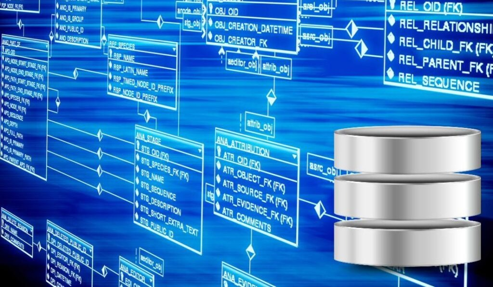

# Curso de Introducción a las Bases de datos | código 71207

> Curso de Introducción a las Bases de datos |      
> Sábados de 10hs a 13hs |      
> Desde 24/02/2024 hasta 30/03/2023 |     
> Código 71207 |    
> sensei: Marcos Pinardi |  

## Base de datos

> ***Definición***  
> Una base de datos o banco de datos, también conocido como DB (Data Base = Base de datos en inglés) o también como BBDD o BD, es un conjunto de datos pertenecientes a un mismo contexto y almacenados sistemáticamente para su posterior uso.  
> En este sentido, una biblioteca puede considerarse una base de datos compuesta en su mayoría por documentos y textos impresos en papel e indexados para su consulta.  

> En la actualidad, y debido al desarrollo tecnológico de campos como la informática y la electrónica, la mayoría de las bases de datos están en formato digital (electrónico), que ofrece un amplio rango de soluciones al problema de almacenar datos.  
> Una base de datos es un “almacén” que nos permite guardar grandes cantidades de información de forma organizada para que luego podamos encontrar y utilizar fácilmente.  

----

https://downloads.mysql.com/archives/workbench/

https://github.com/beekeeper-studio/beekeeper-studio

https://dev.mysql.com/doc/refman/8.0/en/sql-statements.html